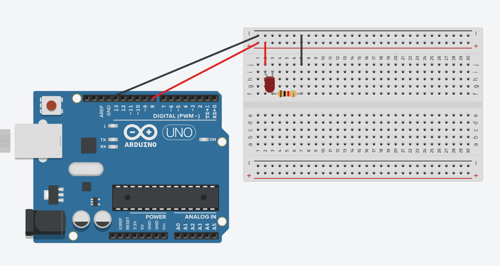
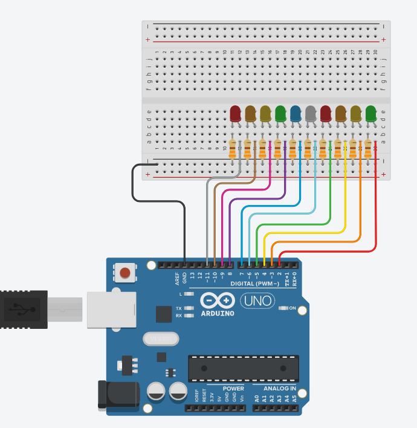
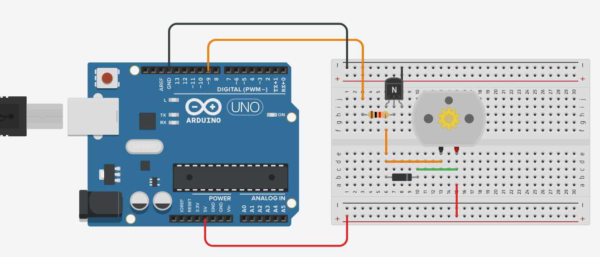
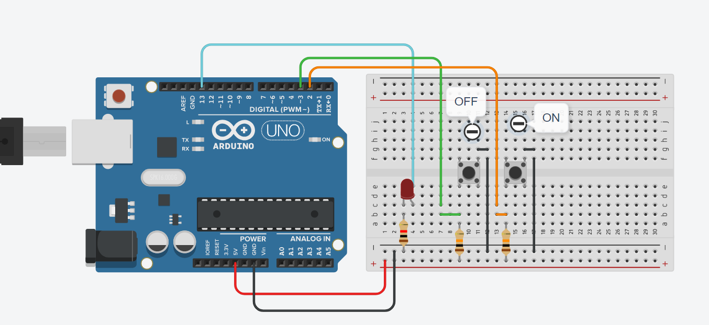
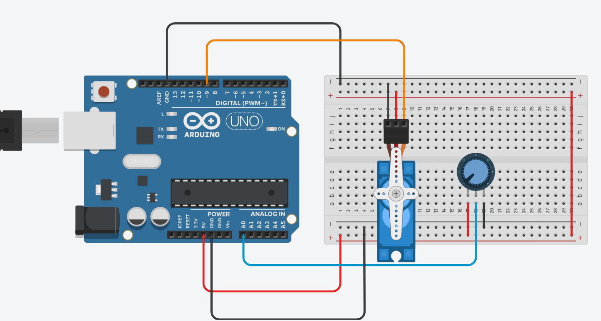
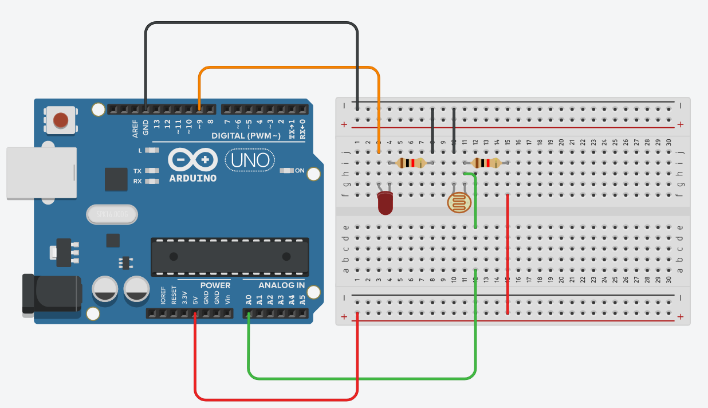

# Robotics 11 - Arduino

This is a compilation of the code and images for all Arduino code in the Robotics 11 class. All code can be viewed in each project's respective folders.

# - Modified Blink Circuit

### Instructions

Blink an LED and print "Hello World printed to the Serial Monitor" with each blink

### Source Code

Source code and images can be found [here](https://github.com/GuhBean/Robotics11Arduino/tree/main/modifiedBlinkCircuit)

# - 10 LED Fun

### Instructions

10 LEDs turning on one at a time in sequence

### Source Code

Source code and images can be found [here](https://github.com/GuhBean/Robotics11Arduino/tree/main/10LEDfun)

# - Spin Motor Spin

### Instructions

Accelerate the motor to full speed over 5 seconds, Run at full speed 2 seconds, decelerate to 0 over 5 seconds. stop for 2 seconds

### Source Code

Source code and images can be found [here](https://github.com/GuhBean/Robotics11Arduino/tree/main/SpinMotorSpin)

# - Pushbuttons

### Instructions

One button turns LED on, the other button turns the LED off

### Source Code

Source code and images can be found [here](https://github.com/GuhBean/Robotics11Arduino/tree/main/Pushbuttons)

# - Potentiometer Servo

### Instructions

Use the potentiometer to control a servo motor

### Source Code

Source code and images can be found [here](https://github.com/GuhBean/Robotics11Arduino/tree/main/potentiometerServo)

# - Night Light

### Instructions

When the light hitting the photoresistor is dimmed, turn on the LED

### Source Code

Source code and images can be found [here](https://github.com/GuhBean/Robotics11Arduino/tree/main/nightLight)

# License

[LICENSE](https://github.com/GuhBean/Robotics11Arduino/blob/main/LICENSE)
